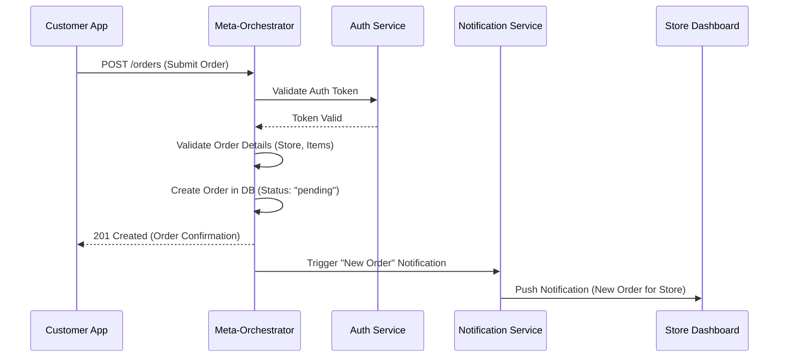

# System Architecture: Smart Delivery Platform

## 1. Overview

The Smart Delivery Platform (SDP) is designed as a modular, scalable, and resilient system based on a microservices-inspired architecture. The core of the platform is the **Meta-Orchestrator**, a central backend service responsible for coordinating the key business logic of the delivery process.

This architecture promotes a clean separation of concerns, allowing for independent development, deployment, and scaling of each component. Communication between components is primarily API-driven, with real-time updates facilitated by WebSocket and event-driven patterns.

## 2. Architectural Principles

*   **Modularity:** Each component (Customer App, Driver App, Store Dashboard, Meta-Orchestrator) is a distinct unit with well-defined responsibilities.
*   **Scalability:** The architecture is designed to scale horizontally. The Meta-Orchestrator and other backend services can be replicated to handle increased load.
*   **Resilience:** The use of asynchronous communication and a central orchestrator helps to isolate failures and ensure the system remains available.
*   **Maintainability:** The separation of concerns and use of modern technology stacks simplify development and long-term maintenance.
*   **Security:** Security is a core consideration, with authentication and authorization managed centrally and enforced at the API level.

## 3. High-Level Architecture Diagram

```mermaid
graph TD
    subgraph "User-Facing Applications"
        C_App[Customer App <br>(Web/Mobile)]
        D_App[Driver App <br>(Mobile)]
        S_Dash[Store Dashboard <br>(Web)]
    end

    subgraph "Backend Services"
        Meta[Meta-Orchestrator <br>(API)]
        Auth[Authentication Service <br>(Supabase)]
        Notify[Notification Service]
        DB[(Database <br>(PostgreSQL))]
    end

    C_App -->|REST API| Meta
    D_App -->|REST API| Meta
    S_Dash -->|REST API| Meta

    Meta -->|Manages| Auth
    Meta -->|Triggers| Notify
    Meta -->|Reads/Writes| DB

    Notify --> C_App
    Notify --> D_App
    Notify --> S_Dash

    style C_App fill:#f9f,stroke:#333,stroke-width:2px
    style D_App fill:#f9f,stroke:#333,stroke-width:2px
    style S_Dash fill:#f9f,stroke:#333,stroke-width:2px
```

## 4. Component Breakdown

### 4.1. Customer App
*   **Description:** The primary interface for customers to browse stores, place orders, and track deliveries.
*   **Technology:** React with Next.js for the web app; potential for a React Native mobile app in the future.
*   **Key Responsibilities:**
    *   User authentication and profile management.
    *   Displaying store and product information.
    *   Shopping cart and order placement workflow.
    *   Real-time order tracking on a map.

### 4.2. Driver App
*   **Description:** The mobile application for drivers to manage their availability, accept jobs, and complete deliveries.
*   **Technology:** React Native.
*   **Key Responsibilities:**
    *   Driver availability status (online/offline).
    *   Receiving and accepting/rejecting order assignments.
    *   Navigation to pickup and delivery locations (map integration).
    *   Updating order status (e.g., "picked up," "delivered").

### 4.3. Store Dashboard
*   **Description:** A web-based interface for store owners and managers to handle their operations on the platform.
*   **Technology:** React with Next.js.
*   **Key Responsibilities:**
    *   Managing store profile and operating hours.
    *   Adding, editing, and managing products and inventory.
    *   Receiving and confirming incoming orders.
    *   Communicating order readiness to the Meta-Orchestrator.

### 4.4. Meta-Orchestrator
*   **Description:** The central nervous system of the platform. It manages the entire order lifecycle and coordinates communication between all other components.
*   **Technology:** Serverless functions (Netlify/Vercel) with a PostgreSQL database managed by Supabase.
*   **Key Responsibilities:**
    *   Exposing a RESTful API for all client applications.
    *   Managing the state machine for orders (pending, accepted, in-transit, etc.).
    *   Executing the driver assignment algorithm.
    *   Triggering notifications to users.
    *   Ensuring data consistency and integrity.

## 5. Data Flow: Order Placement

The following sequence diagram illustrates the process of a customer placing an order.



## 6. Database Schema

The database is a PostgreSQL instance managed by Supabase. The schema is designed to be relational and normalized to ensure data integrity.

*(For the full, detailed schema, please refer to [docs/specifications/database-schema.md](./../specifications/database-schema.md))*

## 7. Technology Stack

The technology stack is chosen to optimize for developer velocity, scalability, and cost-effectiveness, with a strong reliance on modern JavaScript frameworks and managed backend services.

*(For a complete list of technologies, frameworks, and services, see [docs/specifications/tech-stack.md](./../specifications/tech-stack.md))*